

  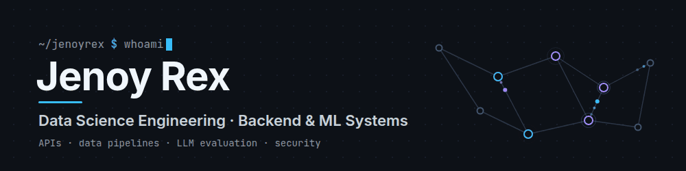

  <b>Data Science Engineering · Backend&nbsp;&amp;&nbsp;ML&nbsp;Systems</b>
   
  <a href="https://www.linkedin.com/in/jenoy-rex-0173111b6/">LINKEDIN</a> &nbsp;·&nbsp; <a href="mailto:jenoyrex95@gmail.com">EMAIL</a> &nbsp;·&nbsp; <a href="https://github.com/Jenoyrex">GITHUB</a>

 

###### ABOUT

I'm a 3rd-year Data Science Engineering student who mostly builds backend systems. I'm drawn to
the infrastructure underneath ML and data work, to experiments that are pinned down before they
run, and to security designed so the server holds as little as possible.

<code>BACKEND&nbsp;&nbsp;&nbsp;&nbsp;</code> &nbsp;FastAPI services, job queues, CI, auth 
<code>EVALUATION&nbsp;</code> &nbsp;tracing, relevance evaluators, offline benchmarks 
<code>EXPERIMENTS</code> &nbsp;seeded environments, preregistered metrics 
<code>SECURITY&nbsp;&nbsp;&nbsp;</code> &nbsp;client-side encryption, least-privilege GitHub Apps

###### SELECTED WORK

01 &nbsp;—&nbsp; LLM TRACING & EVALUATION

## Vigil

Tracing and evaluation for LLM applications. A Python SDK sends spans to a FastAPI ingestion API
backed by ClickHouse; a Postgres-backed worker scores sampled LLM spans with TF-IDF and
embedding-based relevance evaluators, benchmarked offline on WikiQA. Next.js dashboard.

<code>PYTHON / FASTAPI / CLICKHOUSE / POSTGRESQL / NEXT.JS</code>
 
[repository ↗](https://github.com/Jenoyrex/vigil) &nbsp;&nbsp; [live demo ↗](https://vigiljr.netlify.app)

 

02 &nbsp;—&nbsp; CLIENT-SIDE ENCRYPTION

## VaultDrop

A file vault with client-side AES-GCM encryption via the Web Crypto API. Files are encrypted in
the browser before upload; the server stores ciphertext and wrapped keys, never usable key
material.

<code>TYPESCRIPT / NEXT.JS / EXPRESS / PRISMA / POSTGRESQL</code>
 
[repository ↗](https://github.com/Jenoyrex/VaultDrop) &nbsp;&nbsp; [live demo ↗](https://vaultdrop95.netlify.app)

 

03 &nbsp;—&nbsp; CI ANALYTICS

## ADPO

A GitHub App that syncs GitHub Actions run history and runs six statistical analyzers over it:
regressions, slow jobs and steps, retry waste, dependency-install overhead. No LLM in the
analysis.

<code>PYTHON / FASTAPI / POSTGRESQL / REACT</code>
 
[repository ↗](https://github.com/Jenoyrex/ADPO) &nbsp;&nbsp; [live demo ↗](https://adpo-gilt.vercel.app)

 

04 &nbsp;—&nbsp; LLM RESEARCH · COLLEGE GROUP PROJECT

## multi-agent-cooperation

A research harness for LLM-vs-LLM negotiation experiments, with seeded environments and
preregistered welfare and fairness metrics. In progress; no experimental results yet.

<code>PYTHON / ANTHROPIC API / OPENAI API / SQLITE</code>
 
[repository ↗](https://github.com/Jenoyrex/multi-agent-cooperation)

###### STACK

  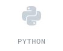
  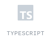
  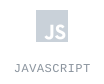
  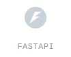
  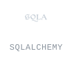
  
  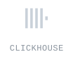
  
   
  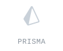
  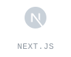
  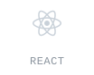
  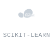
  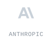
  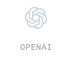
  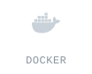
  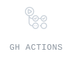

<code>ALSO</code> &nbsp;SQL · Alembic · fastembed · SQLite · pytest · Vitest

###### ACTIVITY

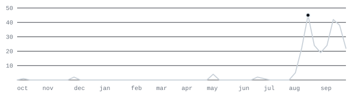

weekly contributions · 251 total · oct 2025 – oct 2026 · peak 45 in the week of 16 aug · snapshot 2 oct 2026
 
GitHub achievement · [Pull Shark ×2](https://github.com/Jenoyrex?tab=achievements)

 

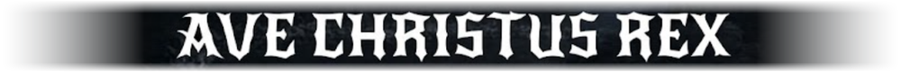
