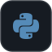
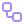
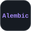
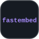
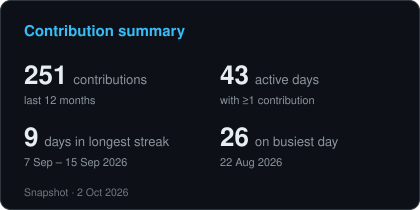
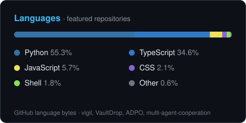
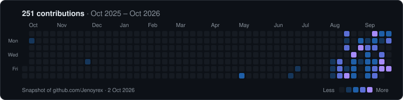
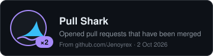

<p align="center">
  
</p>

<p align="center">
  <b>3rd-year Data Science Engineering student</b> building backend systems, LLM evaluation tooling and ML experiments.
</p>


##  About

```python
class JenoyRex:
    role = "3rd-year Data Science Engineering student"

    focus = {
        "backend systems":    "FastAPI services, job queues, CI, auth",
        "LLM evaluation":     "tracing, relevance evaluators, offline benchmarks",
        "ML experimentation": "seeded environments, preregistered metrics",
        "security":           "client-side encryption, least-privilege GitHub Apps",
    }

    languages = ["Python", "TypeScript", "SQL"]
```

##  Connect

<p align="center">
  <a href="https://www.linkedin.com/in/jenoy-rex-0173111b6/"></a>&nbsp;
  <a href="mailto:jenoyrex95@gmail.com"></a>&nbsp;
  <a href="https://github.com/Jenoyrex"></a>
</p>


##  Featured Work

<table>
<tr>
<td width="50%" valign="top">

###  [Vigil](https://github.com/Jenoyrex/vigil)

<sub>LLM OBSERVABILITY · EVALUATION</sub>

LLM tracing and evaluation platform. A Python SDK sends spans to a FastAPI ingestion API backed by
ClickHouse; a Postgres-backed worker scores sampled LLM spans with TF-IDF and embedding-based
relevance evaluators, benchmarked offline on WikiQA with a held-out test split.




<a href="https://github.com/Jenoyrex/vigil"></a>
<a href="https://vigiljr.netlify.app"></a>

</td>
<td width="50%" valign="top">

###  [VaultDrop](https://github.com/Jenoyrex/VaultDrop)

<sub>SECURITY · FULL STACK</sub>

File vault with client-side AES-GCM encryption via the Web Crypto API. The server stores ciphertext
and wrapped keys, never usable key material.


<a href="https://github.com/Jenoyrex/VaultDrop"></a>
<a href="https://vaultdrop95.netlify.app"></a>

</td>
</tr>
<tr>
<td width="50%" valign="top">

###  [ADPO](https://github.com/Jenoyrex/ADPO)

<sub>CI ANALYTICS · STATISTICS</sub>

GitHub App that syncs GitHub Actions run history and runs six statistical analyzers over it
(regressions, slow jobs and steps, retry waste, dependency-install overhead). No LLM in the analysis.


<a href="https://github.com/Jenoyrex/ADPO"></a>
<a href="https://adpo-gilt.vercel.app"></a>

</td>
<td width="50%" valign="top">

###  [multi-agent-cooperation](https://github.com/Jenoyrex/multi-agent-cooperation)

<sub>LLM RESEARCH · COLLEGE GROUP PROJECT</sub>

Research harness for LLM-vs-LLM negotiation experiments with seeded environments and preregistered
welfare and fairness metrics. In progress; no experimental results yet.


<a href="https://github.com/Jenoyrex/multi-agent-cooperation"></a>

</td>
</tr>
</table>


##  Tech Stack

<p align="center">
  
  
  
  
  
  
  
  
  
  
  <br />
  
  
  
  
  
  
  
  
  
  
</p>


##  GitHub Analytics

<p align="center">
  
  
</p>

<p align="center">
  
</p>

##  GitHub Achievements

<p align="center">
  <a href="https://github.com/Jenoyrex?tab=achievements"></a>
</p>


<p align="center">
  <a href="https://www.linkedin.com/in/jenoy-rex-0173111b6/">LinkedIn</a> ·
  <a href="mailto:jenoyrex95@gmail.com">jenoyrex95@gmail.com</a> ·
  <a href="https://github.com/Jenoyrex">GitHub</a>
  <br />
  <sub>Analytics are snapshots of my public GitHub data, generated by <a href="./scripts/generate_stats.py">scripts/generate_stats.py</a>.</sub>
</p>
